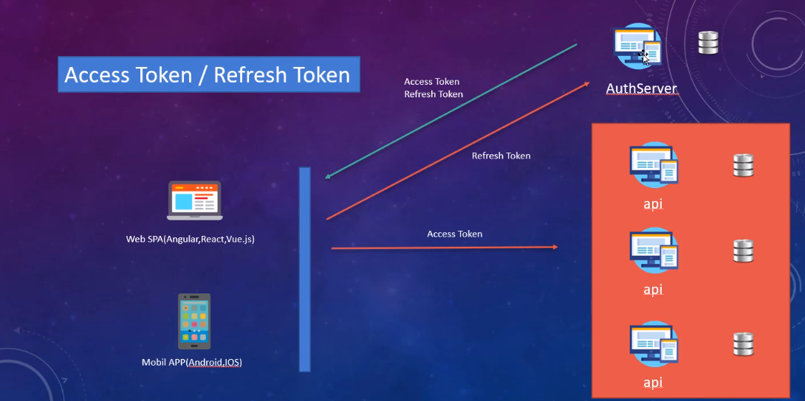

# .NET8WebAPI
 Kullanılan teknoloji ve teknikler:
.Net 8 Web API - JWT - Repository Pattern ile Katmanlı Mimari - Global Hata Yönetimi - UnitOfWork -
DI Container - EF Core 8 - Migrations - Options Pattern - Clean Code

Generic Repository Pattern kullanılan ve Katmanlı Mimari yapısında .Net 8 ile BASIC bir WEB API şablonu.
-- AuthServerAPI hem token dağıtan hem de kendi için de bir proje.
-- API'lerden ikisi sadece token doğrulayan API. 
-- Son API'yi ise hava durumu API'sine benzetebiliriz. Yani üyelik sistemi yok ancak güvenlik açısından clientId ve clientSecret göndererek bir jwtToken ile korunuyor.

Devam ediyor...

